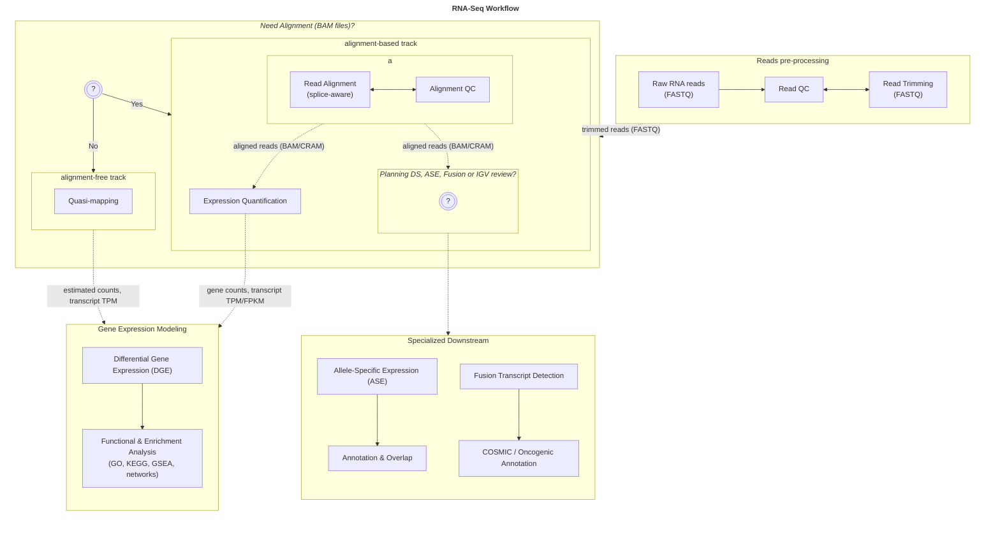

# Bulk RNA-Seq Project

This repository provides a reproducible file structure and documentation system for **bulk RNA-Seq analysis**, from raw data processing to final report generation. It supports both **standard** and **specialized** workflows including differential expression, allele-specific expression and fusion transcript detection.

- [What this file structure is for?](#what-this-file-structure-is-for)
- [How to use this template?](#how-to-use-this-template)
- [Decide on steps & tools in your workflow](#decide-on-steps--tools-in-your-workflow)
  - [Pipeline Decision Tree](#pipeline-decision-tree)
  - [Step selection checklist](#step-selection-checklist)
  - [Remove unused folders](#remove-unused-folders)
- [Folder-by-Folder Documentation](#folder-by-folder-documentation) 


### What this file structure is for?

This template defines a structured directory layout for performing **bulk RNA-seq** computational workflows. It is designed to:
- Guide project organization
- Track decisions, tools, and parameters
- Record issues and troubleshooting
- Facilitate reproducibility and consistency
- Capture documentation to support manuscript writing

RNA sequencing (RNA-seq) s a widely used approach for quantifying gene expression, detecting alternative splicing, allele-specific expression, fusion events, and more. This template supports standard and advanced workflows and is aligned with current best practices. This structure is optimized for **bulk RNA-seq only**. For scRNA-seq, see a separate template (notebook_singlecell_rnaseq/).

Refer to the [Transcriptomics (RNA-seq)](http://localhost:4000/02-rna/transcriptomics/00-landing-page-transcriptomics/) module in the Bioinformatics Workbook for step-by-step instructions.

### How to use this template?

This file structure includes **all core and optional analysis steps**. To adapt it for your project:

1. Review the [pipeline decision tree](#pipeline-decision-tree) and [step checklist](#step-selection-checklist).
2. [Remove unused folders](#remove-unused-folders) to simplify your working directory.  
3. [Document your process](#folder-by-folder-documentation) n each step's `README.md` using a standardized format.


## Decide on steps & tools in your workflow

Each folder in the structure corresponds to a logical step in a typical bulk RNA-seq pipeline.

| folder   | status     | tool options | task description |
|----------|------------|--------------|------------------|
| **00_raw_data/**      | required   | `wget`, `curl`, `ascp`                  | download raw FASTQ files and validate format, completeness, integrity |
| **01_read_qc/**            | required   | `FastQC`, `MultiQC`                     | quality control of raw reads (and QC after trimming cycles), analysis of QC reports |
| **02-trimming/**      | optional   | `Trimmomatic`, `Cutadapt`, `fastp`      | adapter removal and quality trimming (if needed)                      |
| **03_alignment/**     | optional   | `STAR`, `HISAT2`, `minimap2`            | align reads (splice-aware) to reference genome or transcriptome; add **ref_assembly/** subfolder if no reference available |
| **04_quantification/** | required   | `featureCounts`, `HTSeq`, `RSEM`, `Salmon`, `Kallisto`  | quantify reads per gene or transcript (alignment-based or alignment-free (requires quasi-mapping)) |
| **05_dge/** | required   | `DESeq2`, `edgeR`, `limma-voom`         | *default downstream*; differential gene expression analysis between conditions; includes **visualization/** subfolder (pca/ma/volcano/heatmaps) and **downstream/** for functional/enrichment analyses (GO, KEGG, pathways, network plots) |
| **06_ase/** | optional | `ASEReadCounter` (GATK), `phASER`, `MBASED` | *specialized downstream*; allele specific expression calling from alignments + genotypes/phasing; include **annotation/** (imprinting/eQTL overlap)       |
| **07_fusion_detection/** | optional   | `STAR-Fusion`, `Arriba`, `FusionCatcher` | *specialized downstream*; detect, filter and annotate fusion transcripts; include **annotation/** (cosmic, oncogenic pathways)       |
| **final_report/** | required   | `Rmarkdown`, `Jupyter`                  | compile summary of workflow: steps, selected tools, key outputs, troubleshooting notes, exploratory data analysis (EDA), and figures/tables suggested for manuscript |

### Pipeline Decision Tree



### Step selection checklist

Default steps relevant to bulk RNA-seq project are selected:

[x] 00_raw_data/               - download and verify raw FASTQ files  
[x] 01_read_qc/                - raw read quality control  
[x] 02_trimming/               - adapter and quality trimming  
[x] 03_alignment/              - read alignment to reference genome; deselect if following alignment-free workflow  
[x] 04_quantification/         - expression quantification  
[x] 05_dge/                    - differential gene expression analysis  
[ ] 06_ase/                    - allele-specific expression analysis  
[ ] 07_fusion_detection/       - fusion transcript detection  
[x] final_report/              - workflow summary and figures for manuscript  

Update the list with [x] or [ ] to match your analysis plan.


### Remove unused folders

After finalizing your step selection, delete folders you won't use:

```bash
# Example: remove optional steps not used in your project
rm -rf 03_alignment 06_ase 07_fusion_detection
```

## Folder-by-Folder Documentation

Each analysis folder contains a pre-formatted `README.md` to record:
- **What** is being done
- **Why** it's necessary
- **When** it was done
- **Where** the task was performed (working directory)
- **How** it was done (tools & versions, parameters, commands)
- **Results** (outputs, plots, interpretations, insights)

The standardized format requires you to provide the following info for each task in the analysis step:
- Title and Date
- Working directory path
- Task purpose
- Tool commands used
- Parameters and rationale
- Outputs and interpretation

Ensure you fill out each section as you progress through the pipeline:
<code>
# Task Title
- Aug 27, 2025
- path of working directory

task description paragraph
````bash
code block
````
description of the result

## subtitle
- Aug 27, 2025
- path of working directory

task description paragraph
````bash
code block
````
description of the result
</code>

You are encouraged to follow this format consistently throughout the workflow.